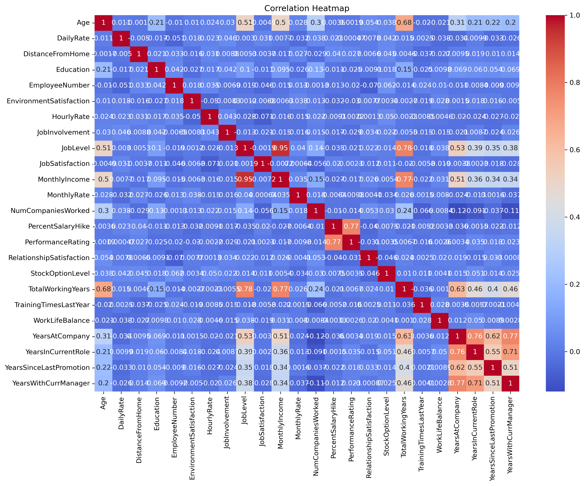
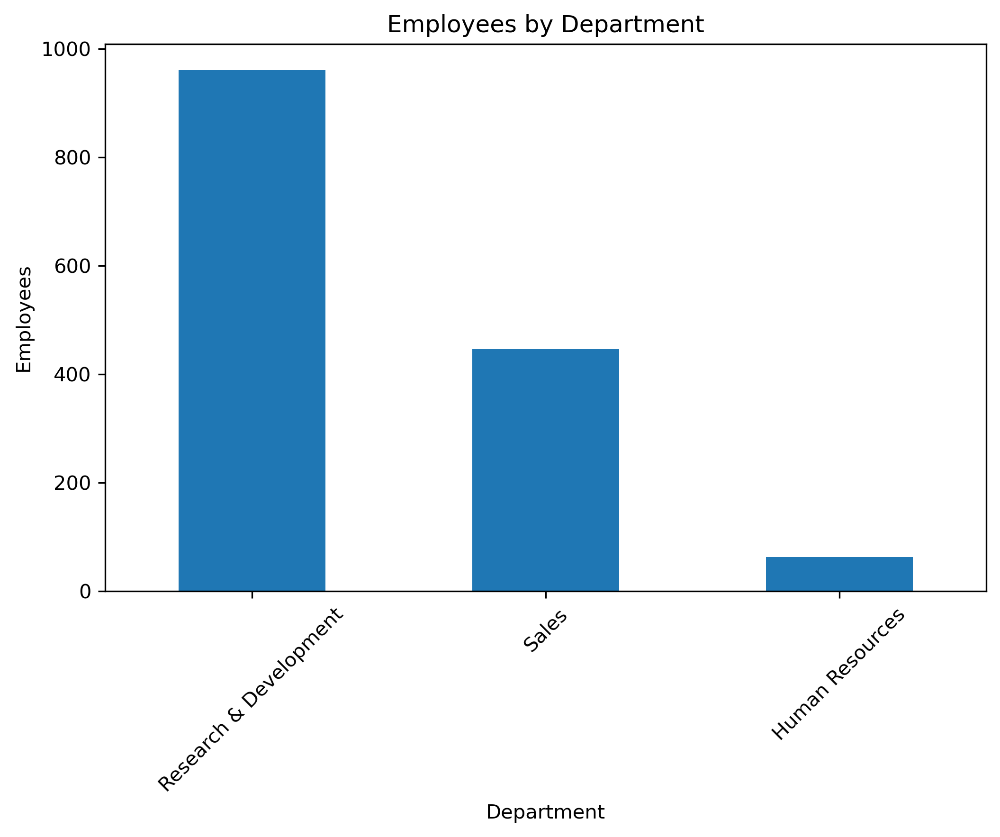
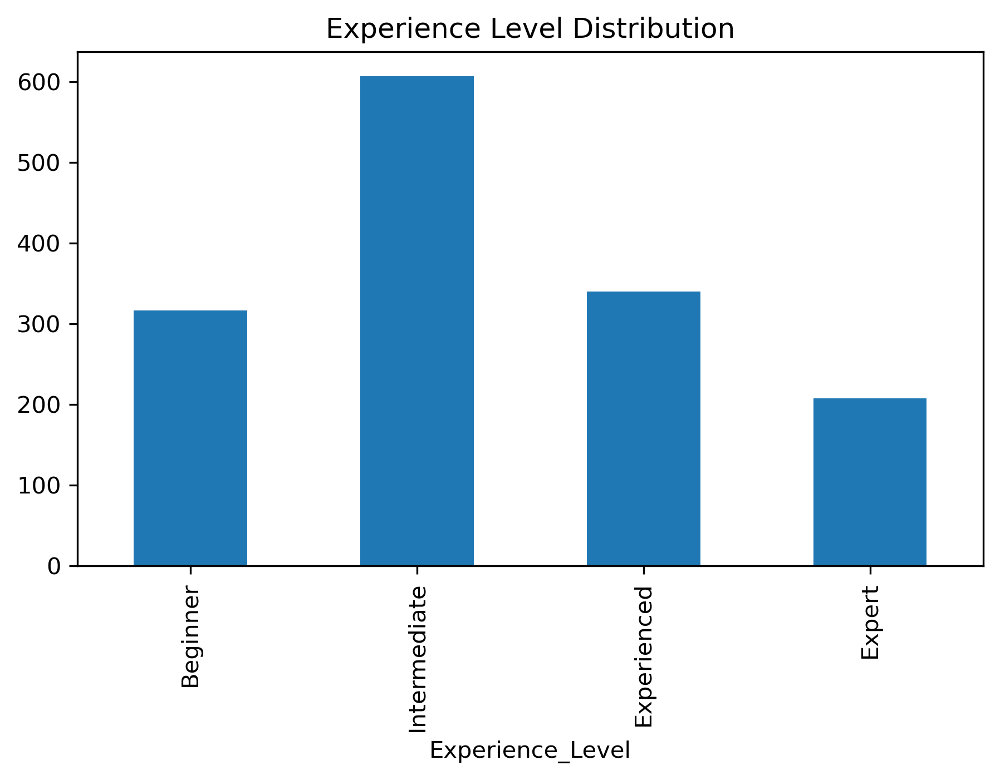
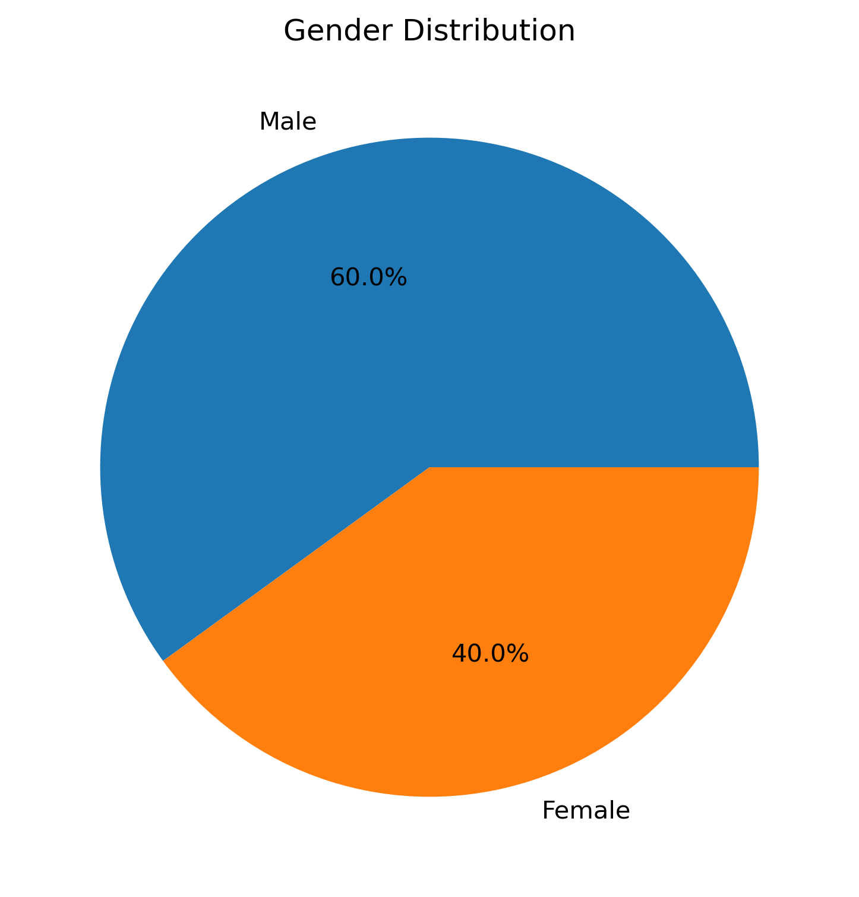
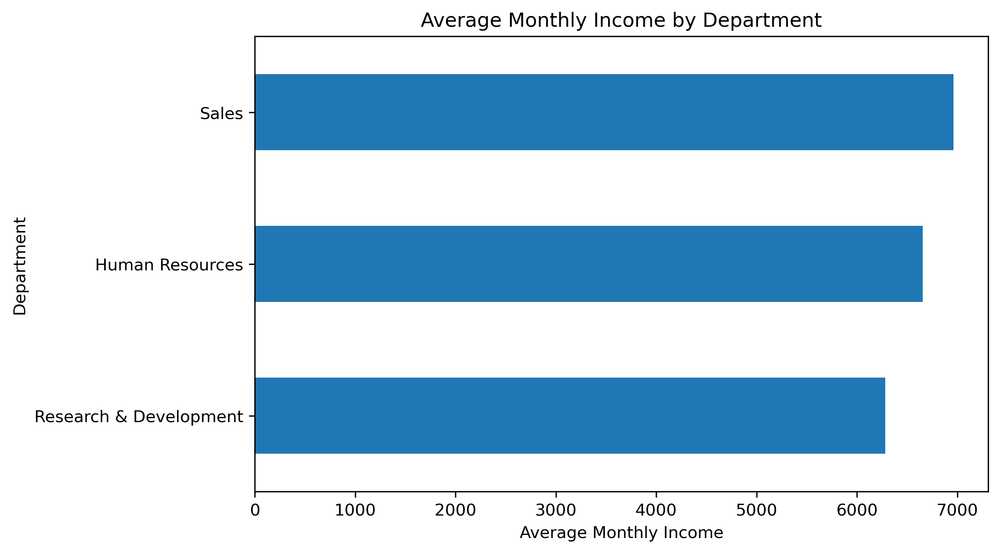
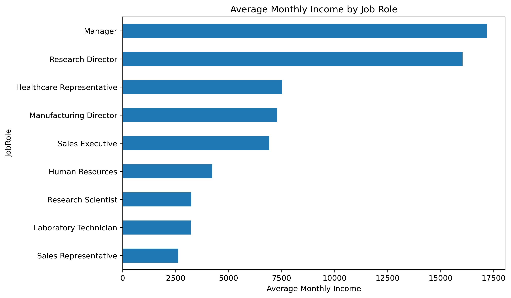
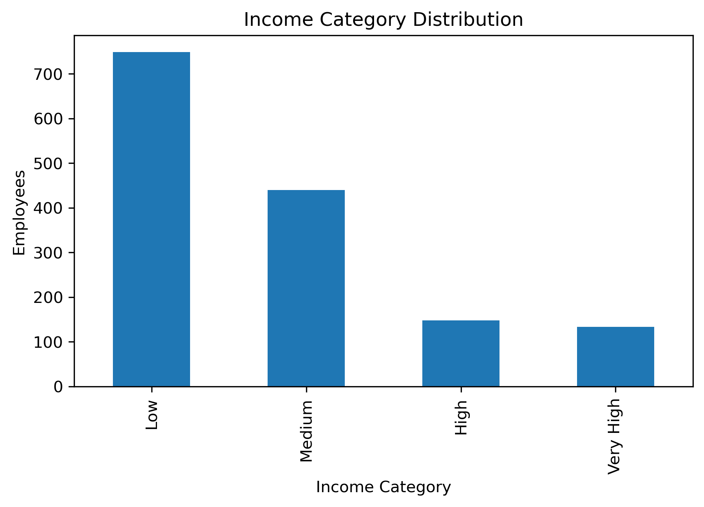
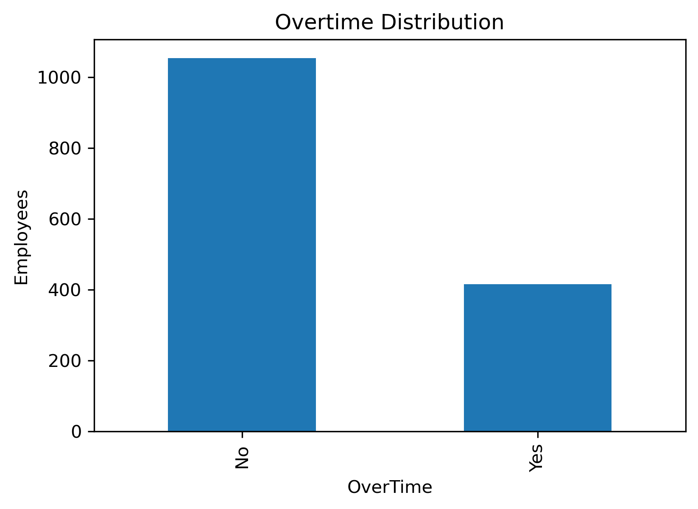

# 📊 Project Visualizations

---

## 🔥 Correlation Heatmap



---

## 👨‍💼 Employees by Department



---

## 📈 Experience Level Distribution



---

## 👨‍💻 Gender Distribution



---

## 💰 Average Monthly Salary by Department



---

## 💵 Salary by Job Role



---

## 📊 Income Category Distribution



---

## ⏰ Overtime Distribution


# HR Employee Data Analysis using Python & Pandas


# HR Employee Data Analysis using Python & Pandas

## Project Overview

This project analyzes employee data from the IBM HR Analytics dataset to uncover valuable insights into employee attrition, salary distribution, departmental performance, and workforce demographics.

The objective is to perform Exploratory Data Analysis (EDA) using Python and Pandas and provide data-driven business insights that can help HR teams improve employee retention and decision-making.

---

## Objectives

- Analyze employee attrition trends
- Understand salary distribution across departments
- Explore employee demographics
- Identify factors affecting employee retention
- Perform data cleaning and feature engineering
- Create meaningful visualizations
- Generate business insights and recommendations

---

## Dataset

- **Dataset:** IBM HR Analytics Employee Attrition & Performance
- **Records:** 1470 Employees
- **Features:** 35 Columns

---

## Technologies Used

- Python
- Pandas
- NumPy
- Matplotlib
- Seaborn
- Jupyter Notebook

---

## Project Structure

```
HR-Employee-Data-Analysis/
│
├── data/
│   └── HR_Employee_Data.csv
│
├── notebook/
│   └── HR_Employee_Analysis.ipynb
│
├── images/
│
├── README.md
│
└── requirements.txt
```

---

## Project Workflow

```
Data Collection
        ↓
Data Exploration
        ↓
Data Cleaning
        ↓
Feature Engineering
        ↓
Exploratory Data Analysis
        ↓
Data Visualization
        ↓
Business Insights
```

---

## Exploratory Data Analysis

The project answers several HR business questions, including:

- What is the employee attrition rate?
- Which department has the highest number of employees?
- Which department has the highest average monthly income?
- Which job roles receive the highest salaries?
- Does overtime increase employee
